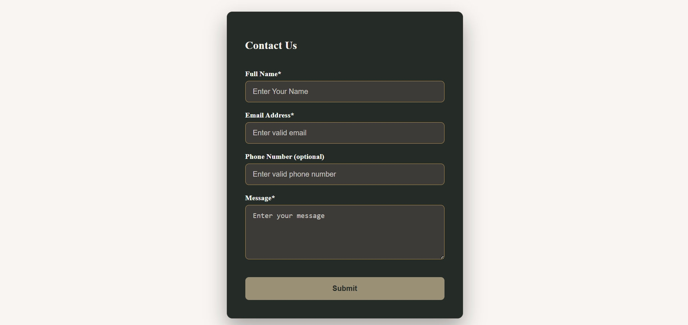

# task4

Contact Form – A Responsive Web Form

Built using HTML, CSS, and JavaScript for validation. The form uses client-side validation with helpful error messages, and a disabled submit button until all required fields are valid. 

---

# Live Demo

[🔗 View Live](https://lisha2804.github.io/task4/)

---

# Screenshots

### Desktop View

---
